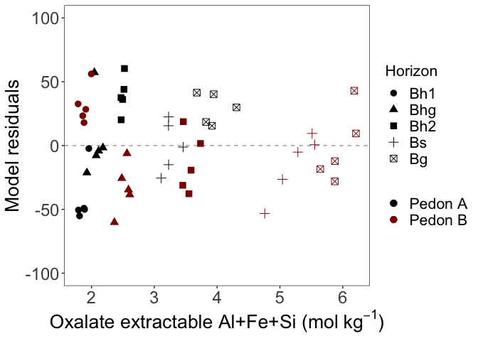

JGR Biogeosciences - Geochemical Figures
================
Emily Lacroix

Last update: 1/13/2022

-   [Set-Up](#set-up)
    -   [libraries](#libraries)
    -   [Data Files](#data-files)
    -   [Read-in data](#read-in-data)
-   [Figure 2](#figure-2)
    -   [Make tibble](#make-tibble)
    -   [Figure 2a: %C and PFP Distance](#figure-2a-c-and-pfp-distance)
    -   [Figure 2b: Delta 14C](#figure-2b-delta-14c)
    -   [Figure 2c: C/N](#figure-2c-cn)
-   [Figure 3: Relative change in 14C vs. PFP
    distance](#figure-3-relative-change-in-14c-vs-pfp-distance)
-   [Figure 4: SRO vs. Distance from
    PFP](#figure-4-sro-vs-distance-from-pfp)
-   [Figure 6: 14C vs. SRO](#figure-6-14c-vs-sro)
-   [Table 1: Linear Regression (Models
    1-3)](#table-1-linear-regression-models-1-3)
    -   [Model 1](#model-1)
    -   [Model 2](#model-2)
    -   [Model 3](#model-3)
-   [Table 1: Multiple Linear Regression (Models
    4-7)](#table-1-multiple-linear-regression-models-4-7)
    -   [Model 4](#model-4)
    -   [Model 5](#model-5)
    -   [Model 6](#model-6)
    -   [Model 7](#model-7)
-   [Table S2: Linear Mixed-Effect Regression (Models
    8-14)](#table-s2-linear-mixed-effect-regression-models-8-14)
    -   [Model 8](#model-8)
    -   [Model 9](#model-9)
    -   [Model 10](#model-10)
    -   [Model 11](#model-11)
    -   [Model 12](#model-12)
    -   [Model 13](#model-13)
    -   [Model 14](#model-14)
-   [Figure S1](#figure-s1)
-   [Figure S7: Residual plots](#figure-s7-residual-plots)
    -   [Residuals of Model 1: 14C vs. SRO Mineral
        content](#residuals-of-model-1-14c-vs-sro-mineral-content)
    -   [Residuals of Model 5: 14C vs. SRO +
        Distance](#residuals-of-model-5-14c-vs-sro--distance)
    -   [Residuals of Model 6: 14C vs. SRO +
        depth](#residuals-of-model-6-14c-vs-sro--depth)
    -   [Residuals of Model 7: 14C vs. SRO + depth +
        distance](#residuals-of-model-7-14c-vs-sro--depth--distance)

# Set-Up

## libraries

    library(tidyverse)
    library(readxl)
    library(lme4)
    library(lmerTest)
    library(MuMIn)
    library(lmtest)

## Data Files

    data_file <- "PuuEke_AllData.xlsx"

## Read-in data

    data <- 
      data_file %>% 
      read_xlsx(sheet = "Data")

# Figure 2

## Make tibble

    fig2_data <- 
      data %>% 
      mutate_at(
        vars(horizon), 
        ~ factor(
          .,
          levels = 
            c(
              "Bh1", 
              "Bhg", 
              "Bh2", 
              "Bs", 
              "Bg"
            )
        )
      ) %>% 
      separate(depth, into = c("top", "bottom", "unit"), remove = FALSE) %>% 
      mutate(
        across(bottom, ~if_else(.=="cm", "86", .)),
        across(c(bottom, top), as.numeric),
        avg_depth_cm = (bottom + top) / 2
      ) %>% 
      select(-c(top, bottom, unit))

## Figure 2a: %C and PFP Distance

    fig2_data %>% 
      ggplot(aes(x = distance_mm, y = perc_c, shape = horizon)) + 
      geom_line(linetype = 2, alpha = 0.6, size = 0.5) +
      geom_point(size = 3, fill = "white") + 
      scale_x_continuous(
        breaks = seq(from = 0, to = 10, by = 2),
        limits = c(-0.1, 10),
        expand = expansion(mult = c(0, 0.05))
      ) + 
      scale_y_continuous(
        breaks = seq(from = 7, to = 14, by = 1)
      ) + 
      scale_shape_manual(
        values = c(16, 24, 15, 21, 17)
      ) + 
      facet_wrap(
        facets = vars(collection_yr), 
        scales = "free_y",
        ncol = 1
      ) + 
      guides(shape = guide_legend(override.aes = list(size = 4))) + 
      theme_bw() + 
      theme(
        strip.background = element_blank(),
        strip.text.x = element_blank(),
        panel.grid = element_blank(),
        aspect.ratio = 1.2,
        legend.position = "right",
        axis.text = element_text(size = 13),
        axis.title = element_text(size = 16),
        axis.title.x = element_text(margin = margin(t = 20)),
        legend.text = element_text(size = 13),
        legend.key.size = unit(0.8, "cm")
      ) + 
      labs(
        x = "Distance from preferential flow path (mm)",
        y = "Carbon (%)",
        shape = NULL
      ) 

<!-- -->

## Figure 2b: Delta 14C

    fig2_data %>% 
      ggplot(aes(x = distance_mm, y = c14, shape = horizon)) + 
      geom_line(linetype = 2, alpha = 0.6, size = 0.5) +
      geom_point(size = 3, fill = "white") + 
      scale_x_continuous(
        breaks = seq(from = 0, to = 10, by = 2),
        limits = c(-0.1, 10),
        expand = expansion(mult = c(0, 0.05))
      ) + 
      scale_shape_manual(
        values = c(16, 24, 15, 21, 17)
      ) + 
      facet_wrap(
        facets = vars(collection_yr), 
        scales = "free_y",
        ncol = 1
      ) + 
      expand_limits(y = -90) + 
      scale_y_continuous(breaks = seq(-100, -900, -100)) + 
      guides(shape = guide_legend(override.aes = list(size = 4))) + 
      theme_bw() + 
      theme(
        strip.background = element_blank(),
        strip.text.x = element_blank(),
        panel.grid = element_blank(),
        aspect.ratio = 1.2,
        legend.position = "right",
        axis.text = element_text(size = 13),
        axis.title = element_text(size = 16),
        axis.title.x = element_text(margin = margin(t = 20)),
        legend.text = element_text(size = 13),
        legend.key.size = unit(0.8, "cm")
      ) + 
      labs(
        x = "Distance from preferential flow paths (mm)",
        y = expression(paste(Delta^{14}, "C (\u2030)")),
        shape = NULL
      ) 

<!-- -->

## Figure 2c: C/N

    fig2_data %>% 
      ggplot(aes(x = distance_mm, y = c_to_n, shape = horizon)) + 
      geom_line(linetype = 2, alpha = 0.6, size = 0.5) +
      geom_point(size = 3, fill = "white") + 
      scale_x_continuous(
        breaks = seq(from = 0, to = 10, by = 2),
        limits = c(-0.1, 10),
        expand = expansion(mult = c(0, 0.05))
      ) + 
      scale_shape_manual(
        values = c(16, 24, 15, 21, 17)
      ) + 
     facet_wrap(
        facets = vars(collection_yr), 
        scales = "free",
        ncol = 1
      ) + 
      guides(shape = guide_legend(override.aes = list(size = 4))) + 
      theme_bw() + 
      theme(
        strip.background = element_blank(),
        strip.text.x = element_blank(),
        panel.grid = element_blank(),
        aspect.ratio = 1.2,
        legend.position = "right",
        axis.text = element_text(size = 13),
        axis.title = element_text(size = 16),
        axis.title.x = element_text(margin = margin(t = 20)),
        legend.text = element_text(size = 13),
        legend.key.size = unit(0.8, "cm")
      ) +  
      labs(
        x = "Distance from preferential flow paths (mm)",
        y = "C/N molar ratio",
        shape = NULL
      ) 

<!-- -->

# Figure 3: Relative change in 14C vs. PFP distance

    fig3_data <- 
      fig2_data %>% 
      pivot_wider(
        id_cols = c(horizon, collection_yr),
        names_from = distance_mm, 
        values_from = c14
      ) %>% 
      mutate_at(vars(collection_yr), as.factor) %>% 
      mutate(
        reference_14 = `0.5`
      ) %>% 
      mutate(
        across(c(`0.5`, `2`, `4`, `6`, `10`), ~ . - reference_14)
      ) %>% 
      pivot_longer(
        cols = c(`0.5`, `2`, `4`, `6`, `10`),
        names_to = "distance_mm",
        values_to = "relative_change_c14"
      ) %>% 
      mutate_at(vars(distance_mm), as.numeric)

    fig3_data %>% 
      ggplot(aes(x = distance_mm)) + 
      geom_line(
        data = 
          . %>% 
          group_by(distance_mm, collection_yr) %>% 
          summarise(avg_realtive_change_c14 = mean(relative_change_c14)),
        aes(
          y = avg_realtive_change_c14
        ),
        color = "darkgrey",
        linetype = 2,
        size = 0.5
      ) + 
      geom_point(
        data = 
          . %>% 
          group_by(distance_mm, collection_yr) %>% 
          summarise(avg_realtive_change_c14 = mean(relative_change_c14)),
        aes(
          y = avg_realtive_change_c14
        ),
        shape = 8,
        size = 3
      ) + 
      geom_point(
        aes(shape = horizon, y = relative_change_c14), 
        size = 3, 
        fill = "white"
      ) + 
      scale_shape_manual(
        values = c(16, 24, 15, 21, 17)
      ) + 
      scale_x_continuous(
        breaks = seq(from = 0, to = 10, by = 2),
        limits = c(-0.1, 10),
        expand = expansion(mult = c(0, 0.05))
      ) + 
      facet_wrap(facets = vars(collection_yr), ncol = 1) +
      theme_bw() + 
      theme(
        strip.background = element_blank(),
        strip.text.x = element_blank(),
        panel.grid = element_blank(),
        aspect.ratio = 1.2,
        legend.position = "right",
        axis.text = element_text(size = 13),
        axis.title = element_text(size = 16),
        axis.title.x = element_text(margin = margin(t = 20)),
        legend.text = element_text(size = 13),
        legend.key.size = unit(0.8, "cm")
      ) +
      labs(
        shape = NULL,
        x = "Distance from preferential flow path (mm)",
        y = expression(paste("Relative Change in ",Delta^{14}, "C (\u2030)"))
      ) 

    ## `summarise()` has grouped output by 'distance_mm'. You can override using the `.groups` argument.
    ## `summarise()` has grouped output by 'distance_mm'. You can override using the `.groups` argument.

<!-- -->

# Figure 4: SRO vs. Distance from PFP

    fig2_data %>% 
      ggplot(aes(x = distance_mm, y = sro_minerals_mol_kg, shape = horizon)) + 
      geom_line(linetype = 2, alpha = 0.6, size = 0.5) +
      geom_point(size = 3, fill = "white") + 
      scale_x_continuous(
        breaks = seq(from = 0, to = 10, by = 2),
        limits = c(-0.1, 10),
        expand = expansion(mult = c(0, 0.05))
      ) + 
      scale_shape_manual(
        values = c(16, 24, 15, 21, 17)
      ) + 
      facet_wrap(
        facets = vars(collection_yr), 
        scales = "free",
        ncol = 1
      ) + 
      theme_bw() + 
      theme(
        strip.background = element_blank(),
        strip.text.x = element_blank(),
        panel.grid = element_blank(),
        aspect.ratio = 1.2,
        legend.position = "right",
        axis.text = element_text(size = 13),
        axis.title = element_text(size = 16),
        axis.title.x = element_text(margin = margin(t = 20)),
        legend.text = element_text(size = 13),
        legend.key.size = unit(0.8, "cm")
      ) + 
      labs(
        x = "Distance from preferential flow path (mm)",
        y = expression("Oxalate extractable Al+Fe+Si (mol "~kg^-1*")"),
        shape = NULL
      ) 

<!-- -->

# Figure 6: 14C vs. SRO

    fig2_data %>% 
      mutate(across(collection_yr, as.factor)) %>% 
      ggplot(aes(x = sro_minerals_mol_kg, y = c14, color = collection_yr)) + 
      geom_smooth(
        method = "lm", 
        se = FALSE,
        color = "darkgray", 
        linetype = "solid"
      ) +
      geom_point(aes(shape = horizon), size = 3) + 
      scale_y_reverse(
        breaks = seq(from = -100, to = -800, by = -100)
      ) +
      scale_shape_manual(
        values = c(16, 2, 15, 1, 17)
      ) + 
      scale_color_manual(
        values = c("black", "darkred"), 
        labels = c("Pedon A", "Pedon B")
      ) +
      expand_limits(y = c(-100, -400)) +
      guides(
        shape = "none"
      ) + 
      theme_bw() + 
      theme(
        strip.background = element_blank(),
        strip.text.x = element_blank(),
        panel.grid = element_blank(),
        aspect.ratio = 1.2,
        legend.position = "right",
        axis.text = element_text(size = 13),
        axis.title = element_text(size = 16),
        #axis.title.x = element_text(margin = margin(t = 20)),
        legend.text = element_text(size = 13),
        legend.key.size = unit(0.8, "cm")
      ) + 
      labs(
        y = expression(paste(Delta^{14}, "C (\u2030)")),
        x = expression("Oxalate extractable Al+Fe+Si (mol"~kg^-1*")"),
        color = NULL,
        shape = NULL
      ) 

<!-- -->

# Table 1: Linear Regression (Models 1-3)

## Model 1

14C vs. SRO Mineral content

    sro_14c_lm <- lm(c14~sro_minerals_mol_kg, data = fig2_data)

    sro_14c_lm %>% summary()

    ## 
    ## Call:
    ## lm(formula = c14 ~ sro_minerals_mol_kg, data = fig2_data)
    ## 
    ## Residuals:
    ##     Min      1Q  Median      3Q     Max 
    ## -91.379 -27.931   1.901  20.554  88.923 
    ## 
    ## Coefficients:
    ##                     Estimate Std. Error t value Pr(>|t|)    
    ## (Intercept)           45.780     15.257   3.001  0.00426 ** 
    ## sro_minerals_mol_kg -134.626      4.304 -31.281  < 2e-16 ***
    ## ---
    ## Signif. codes:  0 '***' 0.001 '**' 0.01 '*' 0.05 '.' 0.1 ' ' 1
    ## 
    ## Residual standard error: 41.16 on 48 degrees of freedom
    ## Multiple R-squared:  0.9532, Adjusted R-squared:  0.9523 
    ## F-statistic: 978.5 on 1 and 48 DF,  p-value: < 2.2e-16

    lmtest::bptest(sro_14c_lm)

    ## 
    ##  studentized Breusch-Pagan test
    ## 
    ## data:  sro_14c_lm
    ## BP = 5.5395, df = 1, p-value = 0.01859

## Model 2

14C vs. Depth (cm)

    depth_14c_lm <- lm(c14~avg_depth_cm, data = fig2_data)

    depth_14c_lm %>% summary()

    ## 
    ## Call:
    ## lm(formula = c14 ~ avg_depth_cm, data = fig2_data)
    ## 
    ## Residuals:
    ##      Min       1Q   Median       3Q      Max 
    ## -243.899  -86.323    9.188   89.467  232.161 
    ## 
    ## Coefficients:
    ##              Estimate Std. Error t value Pr(>|t|)    
    ## (Intercept)  -38.3829    43.6199  -0.880    0.383    
    ## avg_depth_cm  -7.3835     0.8343  -8.849 1.18e-11 ***
    ## ---
    ## Signif. codes:  0 '***' 0.001 '**' 0.01 '*' 0.05 '.' 0.1 ' ' 1
    ## 
    ## Residual standard error: 117.3 on 48 degrees of freedom
    ## Multiple R-squared:   0.62,  Adjusted R-squared:  0.6121 
    ## F-statistic: 78.31 on 1 and 48 DF,  p-value: 1.182e-11

    lmtest::bptest(depth_14c_lm)

    ## 
    ##  studentized Breusch-Pagan test
    ## 
    ## data:  depth_14c_lm
    ## BP = 12.295, df = 1, p-value = 0.0004541

## Model 3

14C vs. distance from PFP

    dist_14c_lm <- lm(c14~distance_mm, data = fig2_data)

    dist_14c_lm %>% summary()

    ## 
    ## Call:
    ## lm(formula = c14 ~ distance_mm, data = fig2_data)
    ## 
    ## Residuals:
    ##     Min      1Q  Median      3Q     Max 
    ## -377.07  -69.75   42.95  147.45  238.31 
    ## 
    ## Coefficients:
    ##             Estimate Std. Error t value Pr(>|t|)    
    ## (Intercept) -353.877     44.754  -7.907 3.04e-10 ***
    ## distance_mm   -9.222      8.006  -1.152    0.255    
    ## ---
    ## Signif. codes:  0 '***' 0.001 '**' 0.01 '*' 0.05 '.' 0.1 ' ' 1
    ## 
    ## Residual standard error: 187.8 on 48 degrees of freedom
    ## Multiple R-squared:  0.0269, Adjusted R-squared:  0.006628 
    ## F-statistic: 1.327 on 1 and 48 DF,  p-value: 0.2551

    lmtest::bptest(dist_14c_lm)

    ## 
    ##  studentized Breusch-Pagan test
    ## 
    ## data:  dist_14c_lm
    ## BP = 0.047179, df = 1, p-value = 0.828

# Table 1: Multiple Linear Regression (Models 4-7)

## Model 4

14C vs. distance + depth

    dist_depth_14c_lm <- lm(c14~distance_mm + avg_depth_cm, data = fig2_data)

    dist_depth_14c_lm %>% summary()

    ## 
    ## Call:
    ## lm(formula = c14 ~ distance_mm + avg_depth_cm, data = fig2_data)
    ## 
    ## Residuals:
    ##     Min      1Q  Median      3Q     Max 
    ## -215.38  -97.12   10.67   84.31  195.27 
    ## 
    ## Coefficients:
    ##              Estimate Std. Error t value Pr(>|t|)    
    ## (Intercept)    3.1167    47.8185   0.065   0.9483    
    ## distance_mm   -9.2221     4.8736  -1.892   0.0646 .  
    ## avg_depth_cm  -7.3835     0.8128  -9.084 6.47e-12 ***
    ## ---
    ## Signif. codes:  0 '***' 0.001 '**' 0.01 '*' 0.05 '.' 0.1 ' ' 1
    ## 
    ## Residual standard error: 114.3 on 47 degrees of freedom
    ## Multiple R-squared:  0.6469, Adjusted R-squared:  0.6319 
    ## F-statistic: 43.05 on 2 and 47 DF,  p-value: 2.376e-11

    lmtest::bptest(dist_depth_14c_lm)

    ## 
    ##  studentized Breusch-Pagan test
    ## 
    ## data:  dist_depth_14c_lm
    ## BP = 17.403, df = 2, p-value = 0.0001663

## Model 5

14C vs. distance + SRO

    dist_sro_14c_lm <- lm(c14~distance_mm + sro_minerals_mol_kg, data = fig2_data)

    dist_sro_14c_lm %>% summary()

    ## 
    ## Call:
    ## lm(formula = c14 ~ distance_mm + sro_minerals_mol_kg, data = fig2_data)
    ## 
    ## Residuals:
    ##     Min      1Q  Median      3Q     Max 
    ## -60.193 -25.608  -1.438  23.126  60.360 
    ## 
    ## Coefficients:
    ##                     Estimate Std. Error t value Pr(>|t|)    
    ## (Intercept)           76.360     13.749   5.554 1.27e-06 ***
    ## distance_mm           -7.261      1.424  -5.099 6.01e-06 ***
    ## sro_minerals_mol_kg -133.987      3.492 -38.368  < 2e-16 ***
    ## ---
    ## Signif. codes:  0 '***' 0.001 '**' 0.01 '*' 0.05 '.' 0.1 ' ' 1
    ## 
    ## Residual standard error: 33.37 on 47 degrees of freedom
    ## Multiple R-squared:  0.9699, Adjusted R-squared:  0.9686 
    ## F-statistic: 757.1 on 2 and 47 DF,  p-value: < 2.2e-16

    lmtest::bptest(dist_sro_14c_lm)

    ## 
    ##  studentized Breusch-Pagan test
    ## 
    ## data:  dist_sro_14c_lm
    ## BP = 4.5851, df = 2, p-value = 0.101

## Model 6

14C vs. SRO + depth

    depth_sro_14c_lm <- 
      lm(c14~avg_depth_cm + sro_minerals_mol_kg, data = fig2_data)

    depth_sro_14c_lm %>% summary()

    ## 
    ## Call:
    ## lm(formula = c14 ~ avg_depth_cm + sro_minerals_mol_kg, data = fig2_data)
    ## 
    ## Residuals:
    ##     Min      1Q  Median      3Q     Max 
    ## -75.174 -25.544  -1.636  24.637  89.674 
    ## 
    ## Coefficients:
    ##                      Estimate Std. Error t value Pr(>|t|)    
    ## (Intercept)           35.4762    14.8981   2.381   0.0214 *  
    ## avg_depth_cm           1.3822     0.5217   2.650   0.0109 *  
    ## sro_minerals_mol_kg -151.8763     7.6708 -19.799   <2e-16 ***
    ## ---
    ## Signif. codes:  0 '***' 0.001 '**' 0.01 '*' 0.05 '.' 0.1 ' ' 1
    ## 
    ## Residual standard error: 38.8 on 47 degrees of freedom
    ## Multiple R-squared:  0.9593, Adjusted R-squared:  0.9576 
    ## F-statistic: 554.1 on 2 and 47 DF,  p-value: < 2.2e-16

    lmtest::bptest(depth_sro_14c_lm)

    ## 
    ##  studentized Breusch-Pagan test
    ## 
    ## data:  depth_sro_14c_lm
    ## BP = 5.9192, df = 2, p-value = 0.05184

## Model 7

14C vs. SRO + depth + distance

    depth_dist_sro_14c_lm <- 
      lm(c14~avg_depth_cm + sro_minerals_mol_kg + distance_mm, data = fig2_data)

    depth_dist_sro_14c_lm %>% summary()

    ## 
    ## Call:
    ## lm(formula = c14 ~ avg_depth_cm + sro_minerals_mol_kg + distance_mm, 
    ##     data = fig2_data)
    ## 
    ## Residuals:
    ##     Min      1Q  Median      3Q     Max 
    ## -63.738 -25.681   0.359  21.134  61.927 
    ## 
    ## Coefficients:
    ##                     Estimate Std. Error t value Pr(>|t|)    
    ## (Intercept)           66.042     13.145   5.024 8.10e-06 ***
    ## avg_depth_cm           1.254      0.415   3.023  0.00408 ** 
    ## sro_minerals_mol_kg -149.663      6.106 -24.509  < 2e-16 ***
    ## distance_mm           -7.032      1.317  -5.339 2.79e-06 ***
    ## ---
    ## Signif. codes:  0 '***' 0.001 '**' 0.01 '*' 0.05 '.' 0.1 ' ' 1
    ## 
    ## Residual standard error: 30.81 on 46 degrees of freedom
    ## Multiple R-squared:  0.9749, Adjusted R-squared:  0.9732 
    ## F-statistic: 595.1 on 3 and 46 DF,  p-value: < 2.2e-16

    lmtest::bptest(depth_dist_sro_14c_lm)

    ## 
    ##  studentized Breusch-Pagan test
    ## 
    ## data:  depth_dist_sro_14c_lm
    ## BP = 3.3137, df = 3, p-value = 0.3457

# Table S2: Linear Mixed-Effect Regression (Models 8-14)

## Model 8

    lmer_c14_sro <- 
      lmer(c14 ~ sro_minerals_mol_kg + (1|collection_yr), data = fig2_data) 

    anova(lmer_c14_sro, ddf = "Kenward-Roger")

    ## Type III Analysis of Variance Table with Kenward-Roger's method
    ##                     Sum Sq Mean Sq NumDF  DenDF F value    Pr(>F)    
    ## sro_minerals_mol_kg 964778  964778     1 24.915  572.23 < 2.2e-16 ***
    ## ---
    ## Signif. codes:  0 '***' 0.001 '**' 0.01 '*' 0.05 '.' 0.1 ' ' 1

    summary(lmer_c14_sro, ddf = "Kenward-Roger")

    ## Linear mixed model fit by REML. t-tests use Kenward-Roger's method [
    ## lmerModLmerTest]
    ## Formula: c14 ~ sro_minerals_mol_kg + (1 | collection_yr)
    ##    Data: fig2_data
    ## 
    ## REML criterion at convergence: 501.5
    ## 
    ## Scaled residuals: 
    ##      Min       1Q   Median       3Q      Max 
    ## -2.24291 -0.68537  0.01895  0.54124  2.14115 
    ## 
    ## Random effects:
    ##  Groups        Name        Variance Std.Dev.
    ##  collection_yr (Intercept)   18.36   4.285  
    ##  Residual                  1686.00  41.061  
    ## Number of obs: 50, groups:  collection_yr, 2
    ## 
    ## Fixed effects:
    ##                     Estimate Std. Error       df t value Pr(>|t|)    
    ## (Intercept)           44.488     19.520    8.391   2.279   0.0507 .  
    ## sro_minerals_mol_kg -134.232      5.611   24.915 -23.921   <2e-16 ***
    ## ---
    ## Signif. codes:  0 '***' 0.001 '**' 0.01 '*' 0.05 '.' 0.1 ' ' 1
    ## 
    ## Correlation of Fixed Effects:
    ##             (Intr)
    ## sr_mnrls_m_ -0.909

    r.squaredGLMM(lmer_c14_sro)

    ## Warning: 'r.squaredGLMM' now calculates a revised statistic. See the help page.

    ##           R2m       R2c
    ## [1,] 0.951764 0.9522836

## Model 9

    lmer_c14_depth <- 
      lmer(c14 ~ avg_depth_cm + (1|collection_yr), data = fig2_data) 

    anova(lmer_c14_depth, ddf = "Kenward-Roger")

    ## Type III Analysis of Variance Table with Kenward-Roger's method
    ##              Sum Sq Mean Sq NumDF  DenDF F value    Pr(>F)    
    ## avg_depth_cm 946449  946449     1 47.087  94.186 8.182e-13 ***
    ## ---
    ## Signif. codes:  0 '***' 0.001 '**' 0.01 '*' 0.05 '.' 0.1 ' ' 1

    summary(lmer_c14_depth, ddf = "Kenward-Roger")

    ## Linear mixed model fit by REML. t-tests use Kenward-Roger's method [
    ## lmerModLmerTest]
    ## Formula: c14 ~ avg_depth_cm + (1 | collection_yr)
    ##    Data: fig2_data
    ## 
    ## REML criterion at convergence: 595.3
    ## 
    ## Scaled residuals: 
    ##     Min      1Q  Median      3Q     Max 
    ## -1.8937 -0.8245  0.1948  0.7431  1.7374 
    ## 
    ## Random effects:
    ##  Groups        Name        Variance Std.Dev.
    ##  collection_yr (Intercept)  7267     85.24  
    ##  Residual                  10049    100.24  
    ## Number of obs: 50, groups:  collection_yr, 2
    ## 
    ## Fixed effects:
    ##              Estimate Std. Error       df t value Pr(>|t|)    
    ## (Intercept)  -57.3827    71.0437   1.7216  -0.808    0.516    
    ## avg_depth_cm  -6.9906     0.7203  47.0872  -9.705 8.18e-13 ***
    ## ---
    ## Signif. codes:  0 '***' 0.001 '**' 0.01 '*' 0.05 '.' 0.1 ' ' 1
    ## 
    ## Correlation of Fixed Effects:
    ##             (Intr)
    ## avg_dpth_cm -0.489

    r.squaredGLMM(lmer_c14_depth)

    ##            R2m       R2c
    ## [1,] 0.5324882 0.7286868

## Model 10

    lmer_c14_dist <- 
      lmer(c14 ~ distance_mm + (1|collection_yr), data = fig2_data) 

    anova(lmer_c14_dist, ddf = "Kenward-Roger")

    ## Type III Analysis of Variance Table with Kenward-Roger's method
    ##             Sum Sq Mean Sq NumDF DenDF F value Pr(>F)
    ## distance_mm  46776   46776     1    47  1.6062 0.2113

    summary(lmer_c14_dist, ddf = "Kenward-Roger")

    ## Linear mixed model fit by REML. t-tests use Kenward-Roger's method [
    ## lmerModLmerTest]
    ## Formula: c14 ~ distance_mm + (1 | collection_yr)
    ##    Data: fig2_data
    ## 
    ## REML criterion at convergence: 642.3
    ## 
    ## Scaled residuals: 
    ##     Min      1Q  Median      3Q     Max 
    ## -1.7808 -0.7472  0.3428  0.5364  1.8253 
    ## 
    ## Random effects:
    ##  Groups        Name        Variance Std.Dev.
    ##  collection_yr (Intercept) 11769    108.5   
    ##  Residual                  29122    170.7   
    ## Number of obs: 50, groups:  collection_yr, 2
    ## 
    ## Fixed effects:
    ##             Estimate Std. Error       df t value Pr(>|t|)
    ## (Intercept) -353.877     86.828    1.358  -4.076    0.101
    ## distance_mm   -9.222      7.277   47.000  -1.267    0.211
    ## 
    ## Correlation of Fixed Effects:
    ##             (Intr)
    ## distance_mm -0.377

    r.squaredGLMM(lmer_c14_dist)

    ##             R2m       R2c
    ## [1,] 0.02281293 0.3040632

## Model 11

    lmer_c14_dist_depth <- 
      lmer(c14 ~ distance_mm + avg_depth_cm + (1|collection_yr), data = fig2_data) 

    anova(lmer_c14_dist_depth, ddf = "Kenward-Roger")

    ## Type III Analysis of Variance Table with Kenward-Roger's method
    ##              Sum Sq Mean Sq NumDF  DenDF  F value    Pr(>F)    
    ## distance_mm   46776   46776     1 46.000   5.0568   0.02936 *  
    ## avg_depth_cm 946190  946190     1 46.079 102.2880 2.782e-13 ***
    ## ---
    ## Signif. codes:  0 '***' 0.001 '**' 0.01 '*' 0.05 '.' 0.1 ' ' 1

    summary(lmer_c14_dist_depth, ddf = "Kenward-Roger")

    ## Linear mixed model fit by REML. t-tests use Kenward-Roger's method [
    ## lmerModLmerTest]
    ## Formula: c14 ~ distance_mm + avg_depth_cm + (1 | collection_yr)
    ##    Data: fig2_data
    ## 
    ## REML criterion at convergence: 585.7
    ## 
    ## Scaled residuals: 
    ##     Min      1Q  Median      3Q     Max 
    ## -1.6747 -0.9724  0.2440  0.7171  1.5753 
    ## 
    ## Random effects:
    ##  Groups        Name        Variance Std.Dev.
    ##  collection_yr (Intercept) 7299     85.44   
    ##  Residual                  9250     96.18   
    ## Number of obs: 50, groups:  collection_yr, 2
    ## 
    ## Fixed effects:
    ##              Estimate Std. Error      df t value Pr(>|t|)    
    ## (Intercept)   -15.968     72.742   1.891  -0.220   0.8476    
    ## distance_mm    -9.222      4.101  46.000  -2.249   0.0294 *  
    ## avg_depth_cm   -6.989      0.691  46.079 -10.114 2.78e-13 ***
    ## ---
    ## Signif. codes:  0 '***' 0.001 '**' 0.01 '*' 0.05 '.' 0.1 ' ' 1
    ## 
    ## Correlation of Fixed Effects:
    ##             (Intr) dstnc_
    ## distance_mm -0.254       
    ## avg_dpth_cm -0.459  0.000

    r.squaredGLMM(lmer_c14_dist_depth)

    ##            R2m      R2c
    ## [1,] 0.5553142 0.751444

## Model 12

    lmer_c14_dist_sro <- 
      lmer(c14 ~ sro_minerals_mol_kg + distance_mm + (1|collection_yr), data = fig2_data) 

    anova(lmer_c14_dist_sro, ddf = "Kenward-Roger")

    ## Type III Analysis of Variance Table with Kenward-Roger's method
    ##                      Sum Sq Mean Sq NumDF  DenDF F value    Pr(>F)    
    ## sro_minerals_mol_kg 1078643 1078643     1 39.294 991.861 < 2.2e-16 ***
    ## distance_mm           29082   29082     1 46.011  26.742 4.933e-06 ***
    ## ---
    ## Signif. codes:  0 '***' 0.001 '**' 0.01 '*' 0.05 '.' 0.1 ' ' 1

    summary(lmer_c14_dist_sro, ddf = "Kenward-Roger")

    ## Linear mixed model fit by REML. t-tests use Kenward-Roger's method [
    ## lmerModLmerTest]
    ## Formula: c14 ~ sro_minerals_mol_kg + distance_mm + (1 | collection_yr)
    ##    Data: fig2_data
    ## 
    ## REML criterion at convergence: 477.5
    ## 
    ## Scaled residuals: 
    ##      Min       1Q   Median       3Q      Max 
    ## -1.74066 -0.74124 -0.07351  0.74138  1.87301 
    ## 
    ## Random effects:
    ##  Groups        Name        Variance Std.Dev.
    ##  collection_yr (Intercept)   59.52   7.715  
    ##  Residual                  1087.49  32.977  
    ## Number of obs: 50, groups:  collection_yr, 2
    ## 
    ## Fixed effects:
    ##                     Estimate Std. Error       df t value Pr(>|t|)    
    ## (Intercept)           72.485     16.578   10.129   4.372  0.00135 ** 
    ## sro_minerals_mol_kg -132.780      4.216   39.294 -31.494  < 2e-16 ***
    ## distance_mm           -7.279      1.408   46.011  -5.171 4.93e-06 ***
    ## ---
    ## Signif. codes:  0 '***' 0.001 '**' 0.01 '*' 0.05 '.' 0.1 ' ' 1
    ## 
    ## Correlation of Fixed Effects:
    ##             (Intr) sr_m__
    ## sr_mnrls_m_ -0.773       
    ## distance_mm -0.390 -0.038

    r.squaredGLMM(lmer_c14_dist_sro)

    ##            R2m       R2c
    ## [1,] 0.9671957 0.9688979

## Model 13

    lmer_c14_sro_depth <- 
      lmer(c14 ~ sro_minerals_mol_kg + avg_depth_cm + (1|collection_yr), data = fig2_data) 

    ## boundary (singular) fit: see ?isSingular

    anova(lmer_c14_sro_depth, ddf = "Kenward-Roger")

    ## Type III Analysis of Variance Table with Kenward-Roger's method
    ##                     Sum Sq Mean Sq NumDF   DenDF  F value   Pr(>F)    
    ## sro_minerals_mol_kg 202032  202032     1  4.4068 134.2263 0.000182 ***
    ## avg_depth_cm          5274    5274     1 13.7571   3.5038 0.082641 .  
    ## ---
    ## Signif. codes:  0 '***' 0.001 '**' 0.01 '*' 0.05 '.' 0.1 ' ' 1

    summary(lmer_c14_sro_depth, ddf = "Kenward-Roger")

    ## Linear mixed model fit by REML. t-tests use Kenward-Roger's method [
    ## lmerModLmerTest]
    ## Formula: c14 ~ sro_minerals_mol_kg + avg_depth_cm + (1 | collection_yr)
    ##    Data: fig2_data
    ## 
    ## REML criterion at convergence: 494.3
    ## 
    ## Scaled residuals: 
    ##      Min       1Q   Median       3Q      Max 
    ## -1.93766 -0.65842 -0.04218  0.63502  2.31140 
    ## 
    ## Random effects:
    ##  Groups        Name        Variance Std.Dev.
    ##  collection_yr (Intercept)    0      0.0    
    ##  Residual                  1505     38.8    
    ## Number of obs: 50, groups:  collection_yr, 2
    ## 
    ## Fixed effects:
    ##                      Estimate Std. Error        df t value Pr(>|t|)    
    ## (Intercept)           35.4762    17.7045    9.7228   2.004 0.073736 .  
    ## sro_minerals_mol_kg -151.8763    13.1091    4.4068 -11.586 0.000182 ***
    ## avg_depth_cm           1.3822     0.7384   13.7571   1.872 0.082641 .  
    ## ---
    ## Signif. codes:  0 '***' 0.001 '**' 0.01 '*' 0.05 '.' 0.1 ' ' 1
    ## 
    ## Correlation of Fixed Effects:
    ##             (Intr) sr_m__
    ## sr_mnrls_m_ -0.250       
    ## avg_dpth_cm -0.261 -0.849
    ## optimizer (nloptwrap) convergence code: 0 (OK)
    ## boundary (singular) fit: see ?isSingular

    r.squaredGLMM(lmer_c14_sro_depth)

    ##            R2m       R2c
    ## [1,] 0.9576584 0.9576584

## Model 14

    lmer_c14_sro_depth_dist <- 
      lmer(c14 ~ 
             sro_minerals_mol_kg + avg_depth_cm + distance_mm + (1|collection_yr), 
           data = fig2_data
        ) 

    ## boundary (singular) fit: see ?isSingular

    anova(lmer_c14_sro_depth_dist, ddf = "Kenward-Roger")

    ## Type III Analysis of Variance Table with Kenward-Roger's method
    ##                     Sum Sq Mean Sq NumDF  DenDF  F value    Pr(>F)    
    ## sro_minerals_mol_kg 194352  194352     1  4.348 204.7002 8.030e-05 ***
    ## avg_depth_cm          4308    4308     1 13.502   4.5372   0.05209 .  
    ## distance_mm          26829   26829     1 45.187  28.2575 3.161e-06 ***
    ## ---
    ## Signif. codes:  0 '***' 0.001 '**' 0.01 '*' 0.05 '.' 0.1 ' ' 1

    summary(lmer_c14_sro_depth_dist, ddf = "Kenward-Roger")

    ## Linear mixed model fit by REML. t-tests use Kenward-Roger's method [
    ## lmerModLmerTest]
    ## Formula: c14 ~ sro_minerals_mol_kg + avg_depth_cm + distance_mm + (1 |  
    ##     collection_yr)
    ##    Data: fig2_data
    ## 
    ## REML criterion at convergence: 469.3
    ## 
    ## Scaled residuals: 
    ##      Min       1Q   Median       3Q      Max 
    ## -2.06854 -0.83343  0.01166  0.68587  2.00977 
    ## 
    ## Random effects:
    ##  Groups        Name        Variance Std.Dev.
    ##  collection_yr (Intercept)   0.0     0.00   
    ##  Residual                  949.4    30.81   
    ## Number of obs: 50, groups:  collection_yr, 2
    ## 
    ## Fixed effects:
    ##                     Estimate Std. Error       df t value Pr(>|t|)    
    ## (Intercept)           66.042     14.924   14.608   4.425 0.000522 ***
    ## sro_minerals_mol_kg -149.663     10.461    4.348 -14.307 8.03e-05 ***
    ## avg_depth_cm           1.254      0.589   13.502   2.130 0.052086 .  
    ## distance_mm           -7.032      1.323   45.187  -5.316 3.16e-06 ***
    ## ---
    ## Signif. codes:  0 '***' 0.001 '**' 0.01 '*' 0.05 '.' 0.1 ' ' 1
    ## 
    ## Correlation of Fixed Effects:
    ##             (Intr) sr_m__ avg_d_
    ## sr_mnrls_m_ -0.195              
    ## avg_dpth_cm -0.260 -0.849       
    ## distance_mm -0.436 -0.068  0.058
    ## optimizer (nloptwrap) convergence code: 0 (OK)
    ## boundary (singular) fit: see ?isSingular

    r.squaredGLMM(lmer_c14_sro_depth_dist)

    ##            R2m       R2c
    ## [1,] 0.9732887 0.9732887

# Figure S1

    fig2_data %>% 
      ggplot(aes(x = distance_mm, y = perc_n, shape = horizon)) + 
      geom_line(linetype = 2, alpha = 0.6, size = 0.5) +
      geom_point(size = 2) + 
      scale_x_continuous(
        breaks = seq(from = 0, to = 10, by = 2),
        limits = c(-0.1, 10),
        expand = expansion(mult = c(0, 0.05))
      ) + 
      scale_shape_manual(
        values = c(16, 2, 15, 1, 17)
      ) + 
     facet_wrap(
        facets = vars(collection_yr), 
        scales = "free",
        ncol = 1
      ) + 
      theme_bw() + 
      theme(
        strip.background = element_blank(),
        strip.text.x = element_blank(),
        panel.grid = element_blank(),
        aspect.ratio = 1.2,
        legend.position = "right",
        axis.text = element_text(size = 12),
        axis.title = element_text(size = 14)
      ) + 
      labs(
        x = "Distance from preferential flow paths (mm)",
        y = "Nitrogen (%)",
        shape = NULL
      ) 

<!-- -->

# Figure S7: Residual plots

## Residuals of Model 1: 14C vs. SRO Mineral content

    fig2_data %>% 
      select(c14, sro_minerals_mol_kg, horizon, collection_yr) %>% 
      mutate(
        predicted = predict(sro_14c_lm), 
        residuals = residuals(sro_14c_lm),
        across(collection_yr, as_factor)
      ) %>% 
      ggplot(aes(x = sro_minerals_mol_kg)) + 
      geom_hline(aes(yintercept = 0), color = "darkgray", linetype = 2) +
      geom_point(
        aes(y = residuals, shape = horizon, color = collection_yr), 
        size = 3
      ) +
      scale_color_manual(
        values = c("black", "darkred"), 
        labels = c("Pedon A", "Pedon B")
      ) +
      scale_y_continuous(limits = c(-100, 100)) +
      theme_bw() + 
      theme(
        panel.grid = element_blank(),
        axis.text = element_text(size = 18),
        axis.title = element_text(size = 20),
        legend.text = element_text(size = 16),
        legend.title = element_text(size = 16)
      ) + 
      labs(
        x = expression("Oxalate extractable Al+Fe+Si (mol"~kg^-1*")"),
        y = "Model residuals",
        shape = "Horizon",
        color = NULL
      )

<!-- -->

## Residuals of Model 5: 14C vs. SRO + Distance

    fig2_data %>% 
      select(c14, sro_minerals_mol_kg, horizon, distance_mm, collection_yr) %>% 
      mutate(
        predicted = predict(dist_sro_14c_lm), 
        residuals = residuals(dist_sro_14c_lm),
        across(collection_yr, as_factor)
      ) %>% 
      ggplot(aes(x = sro_minerals_mol_kg)) + 
      geom_hline(aes(yintercept = 0), color = "darkgray", linetype = 2) +
      geom_point(aes(y = residuals, shape = horizon, color = collection_yr), size = 3) +
      scale_color_manual(
        values = c("black", "darkred"), 
        labels = c("Pedon A", "Pedon B")
      ) +
      scale_y_continuous(limits = c(-100, 100)) +
      theme_bw() + 
      theme(
        panel.grid = element_blank(),
        axis.text = element_text(size = 18),
        axis.title = element_text(size = 20),
        legend.text = element_text(size = 16),
        legend.title = element_text(size = 16)
      ) + 
      labs(
        x = expression("Oxalate extractable Al+Fe+Si (mol"~kg^-1*")"),
        y = "Model residuals",
        shape = "Horizon",
        color = NULL
      )

<!-- -->
Residuals appear less patterned and overall smaller.

## Residuals of Model 6: 14C vs. SRO + depth

    fig2_data %>% 
      select(c14, sro_minerals_mol_kg, horizon, distance_mm, collection_yr) %>% 
      mutate(
        predicted = predict(depth_sro_14c_lm), 
        residuals = residuals(depth_sro_14c_lm),
        across(collection_yr, as_factor)
      ) %>% 
      ggplot(aes(x = sro_minerals_mol_kg)) + 
      geom_hline(aes(yintercept = 0), color = "darkgray", linetype = 2) +
      geom_point(aes(y = residuals, shape = horizon, color = collection_yr), size = 3) +
      scale_color_manual(
        values = c("black", "darkred"), 
        labels = c("Pedon A", "Pedon B")
      ) +
      scale_y_continuous(limits = c(-100, 100)) +
      theme_bw() + 
      theme(
        panel.grid = element_blank(),
        axis.text = element_text(size = 18),
        axis.title = element_text(size = 20),
        legend.text = element_text(size = 16),
        legend.title = element_text(size = 16)
      ) + 
      labs(
        x = expression("Oxalate extractable Al+Fe+Si (mol"~kg^-1*")"),
        y = "Model residuals",
        shape = "Horizon",
        color = NULL
      )

<!-- -->

## Residuals of Model 7: 14C vs. SRO + depth + distance

    fig2_data %>% 
      select(c14, sro_minerals_mol_kg, horizon, distance_mm, collection_yr) %>% 
      mutate(
        predicted = predict(depth_dist_sro_14c_lm), 
        residuals = residuals(depth_dist_sro_14c_lm),
        across(collection_yr, as_factor)
      ) %>% 
      ggplot(aes(x = sro_minerals_mol_kg)) + 
      geom_hline(aes(yintercept = 0), color = "darkgray", linetype = 2) +
      geom_point(aes(y = residuals, shape = horizon, color = collection_yr), size = 3) +
      scale_color_manual(
        values = c("black", "darkred"), 
        labels = c("Pedon A", "Pedon B")
      ) +
      scale_y_continuous(limits = c(-100, 100)) +
      theme_bw() + 
      theme(
        panel.grid = element_blank(),
        axis.text = element_text(size = 18),
        axis.title = element_text(size = 20),
        legend.text = element_text(size = 16),
        legend.title = element_text(size = 16)
      ) + 
      labs(
        x = expression("Oxalate extractable Al+Fe+Si (mol"~kg^-1*")"),
        y = "Model residuals",
        shape = "Horizon",
        color = NULL
      )

<!-- -->
