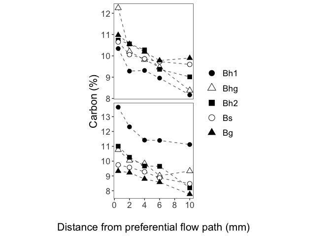
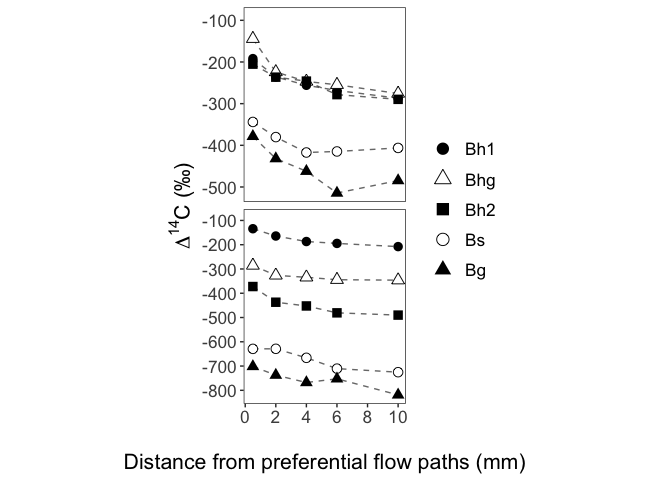

Geochemical Figures
================
Emily Lacroix
9/23/2021

-   [Set-Up](#set-up)
    -   [knitr](#knitr)
    -   [libraries](#libraries)
    -   [Data Files](#data-files)
    -   [Read-in data](#read-in-data)
-   [Figure 2](#figure-2)
    -   [Make tibble](#make-tibble)
    -   [Figure 2a: %C and PFP Distance](#figure-2a-c-and-pfp-distance)
    -   [Figure 2b: Delta 14C](#figure-2b-delta-14c)
    -   [Figure 2c: C/N](#figure-2c-cn)
-   [Figure 3: Ammonium oxalate extractable Al+Fe+Si vs. Distance from
    PFP](#figure-3-ammonium-oxalate-extractable-alfesi-vs-distance-from-pfp)
-   [Figure 4: delta14C vs. Oxalate Extractavle Al+Fe+Si
    (mol/kg)](#figure-4-delta14c-vs-oxalate-extractavle-alfesi-molkg)
    -   [Linear fit - SRO vs. 14C](#linear-fit---sro-vs-14c)
    -   [Figure SI4a: residuals - SRO
        vs. 14C](#figure-si4a-residuals---sro-vs-14c)
-   [Simple linear regression - distance from PFP
    vs. 14C](#simple-linear-regression---distance-from-pfp-vs-14c)
-   [Multiple Linear Regression](#multiple-linear-regression)
    -   [Linear fit - c14 \~ sro\_minerals\_mmol\_kg +
        distance\_mm](#linear-fit---c14--sro_minerals_mmol_kg--distance_mm)
    -   [Figure SI4b - multiple linear regression
        residuals](#figure-si4b---multiple-linear-regression-residuals)
-   [Linear Mixed-Effect Regression](#linear-mixed-effect-regression)
-   [Figure 6: Relative change in delta14C vs. PFP
    distance](#figure-6-relative-change-in-delta14c-vs-pfp-distance)
-   [Figure SI3](#figure-si3)

# Set-Up

## knitr

## libraries

    library(tidyverse)

    ## ── Attaching packages ─────────────────────────────────────── tidyverse 1.3.1 ──

    ## ✓ ggplot2 3.3.5     ✓ purrr   0.3.4
    ## ✓ tibble  3.1.3     ✓ dplyr   1.0.7
    ## ✓ tidyr   1.1.3     ✓ stringr 1.4.0
    ## ✓ readr   2.0.0     ✓ forcats 0.5.1

    ## ── Conflicts ────────────────────────────────────────── tidyverse_conflicts() ──
    ## x dplyr::filter() masks stats::filter()
    ## x dplyr::lag()    masks stats::lag()

    library(readxl)
    library(lme4)

    ## Loading required package: Matrix

    ## 
    ## Attaching package: 'Matrix'

    ## The following objects are masked from 'package:tidyr':
    ## 
    ##     expand, pack, unpack

    library(lmerTest)

    ## 
    ## Attaching package: 'lmerTest'

    ## The following object is masked from 'package:lme4':
    ## 
    ##     lmer

    ## The following object is masked from 'package:stats':
    ## 
    ##     step

    library(MuMIn)
    library(lmtest)

    ## Loading required package: zoo

    ## 
    ## Attaching package: 'zoo'

    ## The following objects are masked from 'package:base':
    ## 
    ##     as.Date, as.Date.numeric

## Data Files

    data_file <- "PuuEke_AllData.xlsx"

## Read-in data

    data <- 
      data_file %>% 
      read_xlsx(sheet = "Data")

# Figure 2

## Make tibble

    fig1_data <- 
      data %>% 
      mutate_at(
        vars(horizon), 
        ~ factor(
          .,
          levels = 
            c(
              "Bh1", 
              "Bhg", 
              "Bh2", 
              "Bs", 
              "Bg"
            )
        )
      )

## Figure 2a: %C and PFP Distance

    fig1_data %>% 
      ggplot(aes(x = distance_mm, y = perc_c, shape = horizon)) + 
      geom_line(linetype = 2, alpha = 0.6, size = 0.5) +
      geom_point(size = 2) + 
      scale_x_continuous(
        breaks = seq(from = 0, to = 10, by = 2),
        limits = c(-0.1, 10),
        expand = expansion(mult = c(0, 0.05))
      ) + 
      scale_y_continuous(
        breaks = seq(from = 7, to = 14, by = 1)
      ) + 
      scale_shape_manual(
        values = c(16, 2, 15, 1, 17)
      ) + 
      facet_wrap(
        facets = vars(collection_yr), 
        scales = "free_y",
        ncol = 1
      ) + 
      theme_bw() + 
      theme(
        strip.background = element_blank(),
        strip.text.x = element_blank(),
        panel.grid = element_blank(),
        aspect.ratio = 1.2,
        legend.position = "right",
        axis.text = element_text(size = 12),
        axis.title = element_text(size = 14)
      ) + 
      labs(
        x = "Distance from PFPs (mm)",
        y = "Carbon (%)",
        shape = NULL
      ) 

<!-- -->

## Figure 2b: Delta 14C

    fig1_data %>% 
      ggplot(aes(x = distance_mm, y = c14, shape = horizon)) + 
      geom_line(linetype = 2, alpha = 0.6, size = 0.5) +
      geom_point(size = 2) + 
      scale_x_continuous(
        breaks = seq(from = 0, to = 10, by = 2),
        limits = c(-0.1, 10),
        expand = expansion(mult = c(0, 0.05))
      ) + 
      scale_shape_manual(
        values = c(16, 2, 15, 1, 17)
      ) + 
      facet_wrap(
        facets = vars(collection_yr), 
        scales = "free_y",
        ncol = 1
      ) + 
      expand_limits(y = -90) + 
      scale_y_continuous(breaks = seq(-100, -900, -100)) + 
      theme_bw() + 
      theme(
        strip.background = element_blank(),
        strip.text.x = element_blank(),
        panel.grid = element_blank(),
        aspect.ratio = 1.2,
        legend.position = "right",
        axis.text = element_text(size = 12),
        axis.title = element_text(size = 14)
      ) + 
      labs(
        x = NULL,
        x = "Distance from preferential flow paths (mm)",
        y = expression(paste(Delta^{14}, "C (\u2030)")),
        shape = NULL
      ) 

<!-- -->

## Figure 2c: C/N

    fig1_data %>% 
      ggplot(aes(x = distance_mm, y = c_to_n, shape = horizon)) + 
      geom_line(linetype = 2, alpha = 0.6, size = 0.5) +
      geom_point(size = 2) + 
      scale_x_continuous(
        breaks = seq(from = 0, to = 10, by = 2),
        limits = c(-0.1, 10),
        expand = expansion(mult = c(0, 0.05))
      ) + 
      scale_shape_manual(
        values = c(16, 2, 15, 1, 17)
      ) + 
     facet_wrap(
        facets = vars(collection_yr), 
        scales = "free",
        ncol = 1
      ) + 
      theme_bw() + 
      theme(
        strip.background = element_blank(),
        strip.text.x = element_blank(),
        panel.grid = element_blank(),
        aspect.ratio = 1.2,
        legend.position = "right",
        axis.text = element_text(size = 12),
        axis.title = element_text(size = 14)
      ) + 
      labs(
        x = "Distance from preferential flow paths (mm)",
        y = "C/N molar ratio",
        shape = NULL
      ) 

<!-- -->

# Figure 3: Ammonium oxalate extractable Al+Fe+Si vs. Distance from PFP

    fig1_data %>% 
      ggplot(aes(x = distance_mm, y = sro_minerals_mmol_kg, shape = horizon)) + 
      geom_line(linetype = 2, alpha = 0.6, size = 0.5) +
      geom_point(size = 2) + 
      scale_x_continuous(
        breaks = seq(from = 0, to = 10, by = 2),
        limits = c(-0.1, 10),
        expand = expansion(mult = c(0, 0.05))
      ) + 
      scale_shape_manual(
        values = c(16, 2, 15, 1, 17)
      ) + 
      facet_wrap(
        facets = vars(collection_yr), 
        scales = "free",
        ncol = 1
      ) + 
      theme_bw() + 
      theme(
        strip.background = element_blank(),
        strip.text.x = element_blank(),
        panel.grid = element_blank(),
        aspect.ratio = 1.2,
        legend.position = "right",
        axis.text = element_text(size = 12),
        axis.title = element_text(size = 14)
      ) + 
      labs(
        x = "Distance from preferential flow paths (mm)",
        y = "Oxalate extractable Al+Fe+Si (moles/kg)",
        shape = NULL
      ) 

<!-- -->

    fig1_data %>% 
      mutate(
        sro_norm = sro_minerals_mmol_kg / perc_c
      ) %>% 
      ggplot(aes(x = distance_mm, y = sro_norm, shape = horizon)) + 
      geom_line(linetype = 2, alpha = 0.6, size = 0.5) +
      geom_point(size = 2) + 
      scale_x_continuous(
        breaks = seq(from = 0, to = 10, by = 2),
        limits = c(-0.1, 10),
        expand = expansion(mult = c(0, 0.05))
      ) + 
      scale_shape_manual(
        values = c(16, 2, 15, 1, 17)
      ) + 
      facet_wrap(
        facets = vars(collection_yr), 
        scales = "free",
        ncol = 1
      ) + 
      theme_bw() + 
      theme(
        strip.background = element_blank(),
        strip.text.x = element_blank(),
        panel.grid = element_blank(),
        aspect.ratio = 1.2,
        legend.position = "right",
        axis.text = element_text(size = 12),
        axis.title = element_text(size = 14)
      ) + 
      labs(
        x = "Distance from preferential flow paths (mm)",
        y = "SRO / % C",
        shape = NULL
      ) 

<!-- -->

# Figure 4: delta14C vs. Oxalate Extractavle Al+Fe+Si (mol/kg)

    fig1_data %>% 
      mutate(across(collection_yr, as.factor)) %>% 
      ggplot(aes(x = sro_minerals_mmol_kg, y = c14, color = collection_yr)) + 
      geom_smooth(
        method = "lm", 
        se = FALSE,
        color = "darkgray", 
        linetype = "solid"
      ) +
      geom_point(aes(shape = horizon), size = 2) + 
      scale_y_reverse(
        breaks = seq(from = -100, to = -800, by = -100)
      ) +
      scale_shape_manual(
        values = c(16, 2, 15, 1, 17)
      ) + 
      scale_color_manual(
        values = c("black", "darkred"), 
        labels = c("Pedon A", "Pedon B")
      ) +
      expand_limits(y = c(-100, -400)) +
      guides(
        shape = "none"
      ) + 
      theme_bw() + 
      theme(
        strip.background = element_blank(),
        strip.text.x = element_blank(),
        panel.grid = element_blank(),
        aspect.ratio = 1.2,
        axis.text = element_text(size = 12),
        axis.title = element_text(size = 14),
        legend.position = "top",
        legend.text = element_text(size = 10)
      ) + 
      labs(
        y = expression(paste(Delta^{14}, "C (\u2030)")),
        x = "Oxalate extractable Al+Fe+Si (mol/kg)",
        color = NULL,
        shape = NULL
      ) 

    ## `geom_smooth()` using formula 'y ~ x'

<!-- -->

## Linear fit - SRO vs. 14C

    sro_14c_lm <- lm(
      c14~sro_minerals_mmol_kg, 
      data = fig1_data 
      )

    sro_14c_lm %>% summary()

    ## 
    ## Call:
    ## lm(formula = c14 ~ sro_minerals_mmol_kg, data = fig1_data)
    ## 
    ## Residuals:
    ##     Min      1Q  Median      3Q     Max 
    ## -91.379 -27.931   1.901  20.554  88.923 
    ## 
    ## Coefficients:
    ##                      Estimate Std. Error t value Pr(>|t|)    
    ## (Intercept)            45.780     15.257   3.001  0.00426 ** 
    ## sro_minerals_mmol_kg -134.626      4.304 -31.281  < 2e-16 ***
    ## ---
    ## Signif. codes:  0 '***' 0.001 '**' 0.01 '*' 0.05 '.' 0.1 ' ' 1
    ## 
    ## Residual standard error: 41.16 on 48 degrees of freedom
    ## Multiple R-squared:  0.9532, Adjusted R-squared:  0.9523 
    ## F-statistic: 978.5 on 1 and 48 DF,  p-value: < 2.2e-16

## Figure SI4a: residuals - SRO vs. 14C

    fig1_data %>% 
      select(c14, sro_minerals_mmol_kg, horizon, collection_yr) %>% 
      mutate(
        predicted = predict(sro_14c_lm), 
        residuals = residuals(sro_14c_lm),
        across(collection_yr, as_factor)
      ) %>% 
      ggplot(aes(x = sro_minerals_mmol_kg)) + 
      geom_hline(aes(yintercept = 0), color = "darkgray", linetype = 2) +
      geom_point(
        aes(y = residuals, shape = horizon, color = collection_yr), 
        size = 3
      ) +
      scale_color_manual(
        values = c("black", "darkred"), 
        labels = c("Pedon A", "Pedon B")
      ) +
      scale_y_continuous(limits = c(-100, 100)) +
      theme_bw() + 
      theme(
        panel.grid = element_blank(),
        axis.text = element_text(size = 18),
        axis.title = element_text(size = 20),
        legend.text = element_text(size = 16),
        legend.title = element_text(size = 16)
      ) + 
      labs(
        x = "SRO Mineral Content (mmol/kg)",
        y = "Model residuals",
        shape = "Horizon",
        color = NULL
      )

<!-- -->

    lmtest::bptest(sro_14c_lm)

    ## 
    ##  studentized Breusch-Pagan test
    ## 
    ## data:  sro_14c_lm
    ## BP = 5.5395, df = 1, p-value = 0.01859

Appears there may be some heteroscedasticity

# Simple linear regression - distance from PFP vs. 14C

    pfp_14c_lm <- lm(
      c14~distance_mm, 
      data = fig1_data 
      )

    pfp_14c_lm %>% summary()

    ## 
    ## Call:
    ## lm(formula = c14 ~ distance_mm, data = fig1_data)
    ## 
    ## Residuals:
    ##     Min      1Q  Median      3Q     Max 
    ## -377.07  -69.75   42.95  147.45  238.31 
    ## 
    ## Coefficients:
    ##             Estimate Std. Error t value Pr(>|t|)    
    ## (Intercept) -353.877     44.754  -7.907 3.04e-10 ***
    ## distance_mm   -9.222      8.006  -1.152    0.255    
    ## ---
    ## Signif. codes:  0 '***' 0.001 '**' 0.01 '*' 0.05 '.' 0.1 ' ' 1
    ## 
    ## Residual standard error: 187.8 on 48 degrees of freedom
    ## Multiple R-squared:  0.0269, Adjusted R-squared:  0.006628 
    ## F-statistic: 1.327 on 1 and 48 DF,  p-value: 0.2551

# Multiple Linear Regression

## Linear fit - c14 \~ sro\_minerals\_mmol\_kg + distance\_mm

    sro_dist_14c_lm <- 
      lm(c14 ~ sro_minerals_mmol_kg + distance_mm, data = fig1_data) 

    sro_dist_14c_lm %>% summary()

    ## 
    ## Call:
    ## lm(formula = c14 ~ sro_minerals_mmol_kg + distance_mm, data = fig1_data)
    ## 
    ## Residuals:
    ##     Min      1Q  Median      3Q     Max 
    ## -60.193 -25.608  -1.438  23.126  60.360 
    ## 
    ## Coefficients:
    ##                      Estimate Std. Error t value Pr(>|t|)    
    ## (Intercept)            76.360     13.749   5.554 1.27e-06 ***
    ## sro_minerals_mmol_kg -133.987      3.492 -38.368  < 2e-16 ***
    ## distance_mm            -7.261      1.424  -5.099 6.01e-06 ***
    ## ---
    ## Signif. codes:  0 '***' 0.001 '**' 0.01 '*' 0.05 '.' 0.1 ' ' 1
    ## 
    ## Residual standard error: 33.37 on 47 degrees of freedom
    ## Multiple R-squared:  0.9699, Adjusted R-squared:  0.9686 
    ## F-statistic: 757.1 on 2 and 47 DF,  p-value: < 2.2e-16

## Figure SI4b - multiple linear regression residuals

    fig1_data %>% 
      select(c14, sro_minerals_mmol_kg, horizon, distance_mm, collection_yr) %>% 
      mutate(
        predicted = predict(sro_dist_14c_lm), 
        residuals = residuals(sro_dist_14c_lm),
        across(collection_yr, as_factor)
      ) %>% 
      ggplot(aes(x = sro_minerals_mmol_kg)) + 
      geom_hline(aes(yintercept = 0), color = "darkgray", linetype = 2) +
      geom_point(aes(y = residuals, shape = horizon, color = collection_yr), size = 3) +
      scale_color_manual(
        values = c("black", "darkred"), 
        labels = c("Pedon A", "Pedon B")
      ) +
      scale_y_continuous(limits = c(-100, 100)) +
      theme_bw() + 
      theme(
        panel.grid = element_blank(),
        axis.text = element_text(size = 18),
        axis.title = element_text(size = 20),
        legend.text = element_text(size = 16),
        legend.title = element_text(size = 16)
      ) + 
      labs(
        x = "SRO Mineral Content (mmol/kg)",
        y = "Model residuals",
        shape = "Horizon",
        color = NULL
      )

<!-- -->

Residuals appear less patterned and overall smaller.

    lmtest::bptest(sro_dist_14c_lm)

    ## 
    ##  studentized Breusch-Pagan test
    ## 
    ## data:  sro_dist_14c_lm
    ## BP = 4.5851, df = 2, p-value = 0.101

# Linear Mixed-Effect Regression

    lmer_c14 <- lmer(c14 ~ distance_mm + sro_minerals_mmol_kg + (1|collection_yr), data = fig1_data) 

    anova(lmer_c14, ddf = "Kenward-Roger")

    ## Type III Analysis of Variance Table with Kenward-Roger's method
    ##                       Sum Sq Mean Sq NumDF  DenDF F value    Pr(>F)    
    ## distance_mm            29082   29082     1 46.011  26.742 4.933e-06 ***
    ## sro_minerals_mmol_kg 1078644 1078644     1 39.294 991.862 < 2.2e-16 ***
    ## ---
    ## Signif. codes:  0 '***' 0.001 '**' 0.01 '*' 0.05 '.' 0.1 ' ' 1

    summary(lmer_c14, ddf = "Kenward-Roger")

    ## Linear mixed model fit by REML. t-tests use Kenward-Roger's method [
    ## lmerModLmerTest]
    ## Formula: c14 ~ distance_mm + sro_minerals_mmol_kg + (1 | collection_yr)
    ##    Data: fig1_data
    ## 
    ## REML criterion at convergence: 477.5
    ## 
    ## Scaled residuals: 
    ##      Min       1Q   Median       3Q      Max 
    ## -1.74066 -0.74124 -0.07351  0.74138  1.87301 
    ## 
    ## Random effects:
    ##  Groups        Name        Variance Std.Dev.
    ##  collection_yr (Intercept)   59.52   7.715  
    ##  Residual                  1087.49  32.977  
    ## Number of obs: 50, groups:  collection_yr, 2
    ## 
    ## Fixed effects:
    ##                      Estimate Std. Error       df t value Pr(>|t|)    
    ## (Intercept)            72.485     16.578   10.129   4.372  0.00135 ** 
    ## distance_mm            -7.279      1.408   46.011  -5.171 4.93e-06 ***
    ## sro_minerals_mmol_kg -132.780      4.216   39.294 -31.494  < 2e-16 ***
    ## ---
    ## Signif. codes:  0 '***' 0.001 '**' 0.01 '*' 0.05 '.' 0.1 ' ' 1
    ## 
    ## Correlation of Fixed Effects:
    ##             (Intr) dstnc_
    ## distance_mm -0.390       
    ## sr_mnrls_m_ -0.773 -0.038

    r.squaredGLMM(lmer_c14)

    ## Warning: 'r.squaredGLMM' now calculates a revised statistic. See the help page.

    ##            R2m       R2c
    ## [1,] 0.9671957 0.9688979

# Figure 6: Relative change in delta14C vs. PFP distance

    fig6_data <- 
      fig1_data %>% 
      pivot_wider(
        id_cols = c(horizon, collection_yr),
        names_from = distance_mm, 
        values_from = c14
      ) %>% 
      mutate_at(vars(collection_yr), as.factor) %>% 
      mutate(
        reference_14 = `0.5`
      ) %>% 
      mutate(
        across(c(`0.5`, `2`, `4`, `6`, `10`), ~ . - reference_14)
      ) %>% 
      pivot_longer(
        cols = c(`0.5`, `2`, `4`, `6`, `10`),
        names_to = "distance_mm",
        values_to = "relative_change_c14"
      ) %>% 
      mutate_at(vars(distance_mm), as.numeric)

    fig6_data %>% 
      ggplot(aes(x = distance_mm)) + 
      geom_line(
        data = 
          . %>% 
          group_by(distance_mm, collection_yr) %>% 
          summarise(avg_realtive_change_c14 = mean(relative_change_c14)),
        aes(
          y = avg_realtive_change_c14
        ),
        color = "darkgrey",
        linetype = 2,
        size = 0.5
      ) + 
      geom_point(
        data = 
          . %>% 
          group_by(distance_mm, collection_yr) %>% 
          summarise(avg_realtive_change_c14 = mean(relative_change_c14)),
        aes(
          y = avg_realtive_change_c14
        ),
        shape = 8,
        size = 2
      ) + 
      geom_point(aes(shape = horizon, y = relative_change_c14), size = 2) + 
      scale_shape_manual(
        values = c(16, 2, 15, 1, 17)
      ) + 
      scale_x_continuous(
        breaks = seq(from = 0, to = 10, by = 2),
        limits = c(-0.1, 10),
        expand = expansion(mult = c(0, 0.05))
      ) + 
      facet_wrap(facets = vars(collection_yr), ncol = 1) +
      theme_bw() + 
      theme(
        strip.background = element_blank(),
        strip.text.x = element_blank(),
        panel.grid = element_blank(),
        aspect.ratio = 1.2,
        axis.text = element_text(size = 12),
        axis.title = element_text(size = 14),
        legend.position = "right"
      ) +
      labs(
        shape = NULL,
        x = "Distance from preferential flow paths (mm)",
        y = expression(paste("Relative Change in",Delta^{14}, "C (\u2030)"))
      ) 

    ## `summarise()` has grouped output by 'distance_mm'. You can override using the `.groups` argument.
    ## `summarise()` has grouped output by 'distance_mm'. You can override using the `.groups` argument.

<!-- -->

# Figure SI3

    fig1_data %>% 
      ggplot(aes(x = distance_mm, y = perc_n, shape = horizon)) + 
      geom_line(linetype = 2, alpha = 0.6, size = 0.5) +
      geom_point(size = 2) + 
      scale_x_continuous(
        breaks = seq(from = 0, to = 10, by = 2),
        limits = c(-0.1, 10),
        expand = expansion(mult = c(0, 0.05))
      ) + 
      scale_shape_manual(
        values = c(16, 2, 15, 1, 17)
      ) + 
     facet_wrap(
        facets = vars(collection_yr), 
        scales = "free",
        ncol = 1
      ) + 
      theme_bw() + 
      theme(
        strip.background = element_blank(),
        strip.text.x = element_blank(),
        panel.grid = element_blank(),
        aspect.ratio = 1.2,
        legend.position = "right",
        axis.text = element_text(size = 12),
        axis.title = element_text(size = 14)
      ) + 
      labs(
        x = "Distance from preferential flow paths (mm)",
        y = "Nitrogen (%)",
        shape = NULL
      ) 

<!-- -->
