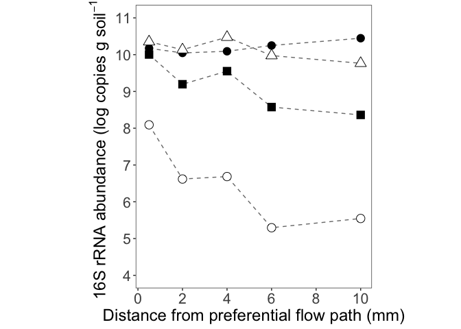
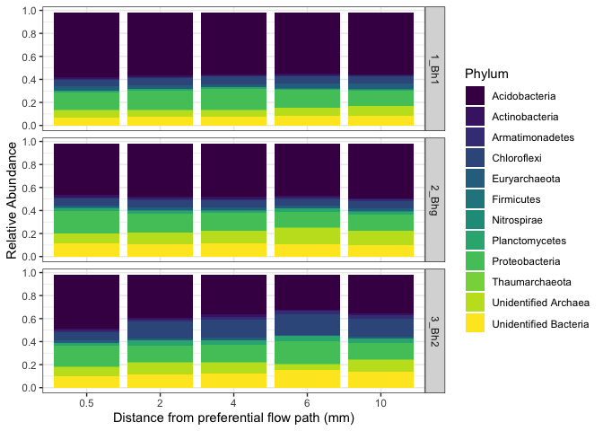

JGR Biogeosciences - Microbial Figures
================
Emily Lacroix

Last update: 1/13/2022

-   [Set-up](#set-up)
    -   [libraries](#libraries)
    -   [files](#files)
-   [Analysis](#analysis)
    -   [Data clean-up](#data-clean-up)
        -   [Filter and subset](#filter-and-subset)
        -   [Sample Info](#sample-info)
        -   [Putative Anaerobes](#putative-anaerobes)
        -   [16S abundance](#16s-abundance)
-   [Figures](#figures)
    -   [Figure 5a: 16S rRNA Gene
        Copies](#figure-5a-16s-rrna-gene-copies)
    -   [Figure 5b: Relative Abundance of putative
        anaerobes](#figure-5b-relative-abundance-of-putative-anaerobes)
        -   [ID the 2 dominant putative anaerobe
            phyla](#id-the-2-dominant-putative-anaerobe-phyla)
    -   [Figure S5: NMDS](#figure-s5-nmds)
    -   [Figure S6: Abundant phyla](#figure-s6-abundant-phyla)

# Set-up

## libraries

    library(tidyverse)
    library(readxl)
    library(phyloseq)

    ## Warning: package 'phyloseq' was built under R version 4.0.3

    library(ggrepel)

## files

    phyloseq_object_file <- "MPC_16S_phyloseq_2019_07_23.rds"

    parent_data_file <- "PuuEke_AllData.xlsx"

# Analysis

## Data clean-up

### Filter and subset

Filter and subset phyloseq object to exclude rare taxa (&lt; 200) and
create subsets that focus solely on the upper horizons for asv analysis

    #read in object
    raw_phyloseq_object <- phyloseq_object_file %>% read_rds()

    #filter out low frequency (<200) reads
    phyloseq_trimmed <- 
      subset_samples(raw_phyloseq_object, sample_sums(raw_phyloseq_object) > 200)

    #create a object that encompasses just the upper horizons
    phyloseq_upperhorizons <-   
      subset_samples(phyloseq_trimmed,horizon %in% c("1_Bh1", "2_Bhg", "3_Bh2")) 

    # Convert asv to report relative abundance of the upper horizons
    phyloseq_upperhzn_rel_abund <- 
      transform_sample_counts(phyloseq_upperhorizons, function(x) x / sum(x))

    # Turn phyloseq object into a flattened tibble for easy plotting 

    flattened_phyloseq_obj <- #rename to flattened ps obj
      psmelt(phyloseq_upperhzn_rel_abund) %>% 
      select(
        asv = OTU, 
        sample = Sample, 
        rel_abund = Abundance
      ) %>% 
      pivot_wider(id_cols = asv, names_from = sample, values_from = rel_abund)

Save off the taxonomic information

    taxonomic_table <- 
      phyloseq_upperhzn_rel_abund %>% 
      tax_table() %>% 
      as("matrix") %>% 
      as_tibble(rownames = "asv")

### Sample Info

Create sample information table from phyloseq object; create one that
includes counts from 4 horizons and another that contains sample
metadata for the upper horizons

    all_sample_data <- 
      sample_data(raw_phyloseq_object) %>% 
      as_tibble(rownames = "sample")

    sample_data <- 
      sample_data(phyloseq_upperhzn_rel_abund) %>% 
      as_tibble(rownames = "sample")

### Putative Anaerobes

Read-in the ASVs identified as putative anaerobes per RAxML tree

    putative_anaerobes <- 
      parent_data_file %>% 
      read_xlsx(sheet = "PutativeAnaerobes") %>% 
      select(asv = ASV) %>% 
      mutate(anaerobe = TRUE)

### 16S abundance

    abund_16s <- 
      parent_data_file %>% 
      read_xlsx(sheet = "qPCR") %>% 
      mutate(
        across(horizon, ~ factor(., levels = c("Bh1", "Bhg", "Bh2", "Bs")))
      ) %>% 
      group_by(sample_id, horizon, depth, avg_dist_mm, pfp_distance_mm) %>% 
      summarise(
        mean_log_copy_per_g_soil = mean(log_copies_per_g_soil, na.rm = TRUE),
        se_log_copy_per_g_soil = sd(log_copies_per_g_soil) / sqrt(n())
      ) 

# Figures

## Figure 5a: 16S rRNA Gene Copies

Shown with error bars –&gt; error bars are smaller than size of symbol

    abund_16s %>% 
      ggplot(
        aes(
          x = avg_dist_mm, 
          y = mean_log_copy_per_g_soil, 
          shape = horizon
        )
      ) + 
      geom_line(linetype = 2, alpha = 0.6, size = 0.5) +
      geom_errorbar(
        aes(
          ymin = mean_log_copy_per_g_soil - se_log_copy_per_g_soil,
          ymax = mean_log_copy_per_g_soil + se_log_copy_per_g_soil
        ),
        width = 0.25
      ) +
      geom_point(size = 4, fill = "white") + 
      scale_x_continuous(
        breaks = seq(from = 0, to = 10, by = 2),
        limits = c(-0.1, 10),
        expand = expansion(mult = c(0, 0.05))
      ) + 
      scale_y_continuous(
        breaks = seq(from = 4, to = 14, by = 1),
        limits = c(4, 11)
      ) +
      scale_shape_manual(
        values = c(16, 24, 15, 21)
      ) + 
      theme_bw() + 
      theme(
        strip.background = element_blank(),
        strip.text.x = element_blank(),
        panel.grid = element_blank(),
        aspect.ratio = 1.2,
        legend.position = "none",
        axis.text = element_text(size = 16),
        axis.title = element_text(size = 18)
      ) + 
      labs(
        x = "Distance from preferential flow path (mm)",
        y = expression("16S rRNA abundance (log copies g soil"^-1*")"),
        shape = NULL
      ) 

<!-- -->

## Figure 5b: Relative Abundance of putative anaerobes

    flattened_phyloseq_obj %>% 
      left_join(putative_anaerobes, by = "asv") %>% 
      mutate_at(
        vars(anaerobe),
        ~ if_else(is.na(.), FALSE, TRUE)
      ) %>% 
      filter(anaerobe == TRUE) %>% 
      select(-asv) %>% 
      pivot_longer(
        cols = contains("fastq"), 
        names_to = "sample", 
        values_to = "relative_abundance"
      ) %>% 
      group_by(sample) %>% 
      summarise(relative_anaerobe = sum(relative_abundance)) %>% 
      left_join(sample_data, by = "sample") %>% 
      mutate_at(vars(distance_mm), as.numeric) %>% 
      mutate_at(
        vars(horizon), 
        ~ factor(
          .,
          levels = 
            c(
              "1_Bh1", 
              "2_Bhg", 
              "3_Bh2"
            ),
          labels = 
            c(
              "Bh1", 
              "Bhg", 
              "Bh2"
            )
        )
      ) %>% 
      ggplot(aes(x = distance_mm, y = relative_anaerobe, shape = horizon)) + 
      geom_line(linetype = 2, alpha = 0.5) + 
      geom_point(size = 4, fill = "white") + 
      scale_y_continuous(
        breaks = c(0.02, 0.04, 0.06, 0.08, 0.10, 0.12),
        labels = scales::percent_format(accuracy = 1)
      ) + 
      scale_x_continuous(
        breaks = seq(from = 0, to = 10, by = 2),
        limits = c(-0.1, 10),
        expand = expansion(mult = c(0, 0.05))
      ) +
      scale_shape_manual(
        values = c(16, 24, 15, 21, 17)
      ) + 
      theme_bw() + 
      theme(
        strip.background = element_blank(),
        strip.text.x = element_blank(),
        panel.grid = element_blank(),
        aspect.ratio = 1.2,
        legend.position = "none",
        axis.text = element_text(size = 16),
        axis.title = element_text(size = 18)
      ) + 
      labs(
        x = "Distance from preferential flow path (mm)",
        y = "Relative abundance of putative anaerobes (%)",
        shape = NULL
      ) 

<!-- -->

### ID the 2 dominant putative anaerobe phyla

    flattened_phyloseq_obj %>% 
      left_join(putative_anaerobes, by = "asv") %>% 
      mutate_at(
        vars(anaerobe),
        ~ if_else(is.na(.), FALSE, TRUE)
      ) %>% 
      filter(anaerobe == TRUE) %>% 
      pivot_longer(
        cols = contains("fastq"), 
        names_to = "sample", 
        values_to = "relative_abundance"
      ) %>% 
      group_by(sample) %>% 
      slice_max(relative_abundance, n = 2) %>% 
      left_join(taxonomic_table, by = "asv") %>% 
      left_join(sample_data, by = "sample") %>% 
      mutate_at(vars(distance_mm), as.numeric) %>% 
      arrange(horizon, distance_mm) %>% 
      select(horizon, distance_mm, Kingdom, Phylum, relative_abundance, asv)

    ## # A tibble: 30 × 7
    ## # Groups:   sample [15]
    ##    sample    horizon distance_mm Kingdom Phylum  relative_abunda… asv           
    ##    <chr>     <fct>         <dbl> <chr>   <chr>              <dbl> <chr>         
    ##  1 Yoko.12A… 1_Bh1           0.5 Archaea <NA>              0.0366 CGGTAGTCTAGGG…
    ##  2 Yoko.12A… 1_Bh1           0.5 Archaea Euryar…           0.0312 CGGTAGTCTAGGG…
    ##  3 Yoko.12A… 1_Bh1           2   Archaea <NA>              0.0380 CGGTAGTCTAGGG…
    ##  4 Yoko.12A… 1_Bh1           2   Archaea Euryar…           0.0239 CGGTAGTCTAGGG…
    ##  5 Yoko.12A… 1_Bh1           4   Archaea <NA>              0.0356 CGGTAGTCTAGGG…
    ##  6 Yoko.12A… 1_Bh1           4   Archaea Euryar…           0.0214 CGGTAGTCTAGGG…
    ##  7 Yoko.12A… 1_Bh1           6   Archaea <NA>              0.0530 CGGTAGTCTAGGG…
    ##  8 Yoko.12A… 1_Bh1           6   Archaea Euryar…           0.0321 CGGTAGTCTAGGG…
    ##  9 Yoko.12A… 1_Bh1          10   Archaea <NA>              0.0609 CGGTAGTCTAGGG…
    ## 10 Yoko.12A… 1_Bh1          10   Archaea Euryar…           0.0371 CGGTAGTCTAGGG…
    ## # … with 20 more rows

## Figure S5: NMDS

    set.seed(123)

    my.ord <- ordinate(phyloseq_upperhorizons, "NMDS", "bray")

    ## Square root transformation
    ## Wisconsin double standardization
    ## Run 0 stress 0.0290721 
    ## Run 1 stress 0.0288754 
    ## ... New best solution
    ## ... Procrustes: rmse 0.02073639  max resid 0.0532834 
    ## Run 2 stress 0.02906716 
    ## ... Procrustes: rmse 0.02054172  max resid 0.05352633 
    ## Run 3 stress 0.03251944 
    ## Run 4 stress 0.02887817 
    ## ... Procrustes: rmse 0.0003475785  max resid 0.0008917718 
    ## ... Similar to previous best
    ## Run 5 stress 0.03251568 
    ## Run 6 stress 0.0466639 
    ## Run 7 stress 0.03251162 
    ## Run 8 stress 0.03251292 
    ## Run 9 stress 0.02886348 
    ## ... New best solution
    ## ... Procrustes: rmse 0.002271259  max resid 0.005840831 
    ## ... Similar to previous best
    ## Run 10 stress 0.02887632 
    ## ... Procrustes: rmse 0.002377104  max resid 0.006104298 
    ## ... Similar to previous best
    ## Run 11 stress 0.0288683 
    ## ... Procrustes: rmse 0.001145906  max resid 0.002944553 
    ## ... Similar to previous best
    ## Run 12 stress 0.0288627 
    ## ... New best solution
    ## ... Procrustes: rmse 0.0002423332  max resid 0.0006227533 
    ## ... Similar to previous best
    ## Run 13 stress 0.02886091 
    ## ... New best solution
    ## ... Procrustes: rmse 0.0007812059  max resid 0.00200973 
    ## ... Similar to previous best
    ## Run 14 stress 0.02905134 
    ## ... Procrustes: rmse 0.01645726  max resid 0.04284755 
    ## Run 15 stress 0.02914549 
    ## ... Procrustes: rmse 0.02069289  max resid 0.05409499 
    ## Run 16 stress 0.03261551 
    ## Run 17 stress 0.02886133 
    ## ... Procrustes: rmse 0.0002298533  max resid 0.0005912421 
    ## ... Similar to previous best
    ## Run 18 stress 0.02886481 
    ## ... Procrustes: rmse 0.001390201  max resid 0.003573373 
    ## ... Similar to previous best
    ## Run 19 stress 0.02906459 
    ## ... Procrustes: rmse 0.01716663  max resid 0.04473044 
    ## Run 20 stress 0.02911636 
    ## ... Procrustes: rmse 0.01935142  max resid 0.05052504 
    ## *** Solution reached

    plot_ordination(
      phyloseq_upperhorizons, 
      my.ord, 
      shape = "horizon"
    ) + 
      geom_point(size = 3) +
      geom_text_repel(
        mapping = aes(label = str_c(distance_mm, " mm")),
      ) +
      scale_shape_manual(
        values = c(16, 2, 15)
      ) + 
      scale_x_continuous(expand = c(0.1,0.1)) + 
      theme_bw() + 
      theme(
        strip.background = element_blank(),
        strip.text.x = element_blank(),
        panel.grid = element_blank(),
        aspect.ratio = 1,
        legend.position = "none",
        axis.text = element_text(size = 14),
        axis.title = element_text(size = 16)
      ) + 
      labs(
        shape = NULL
      ) 

<!-- -->

## Figure S6: Abundant phyla

These are the 10 most abundant phyla in each sample

    top_10_phyla <- 
      flattened_phyloseq_obj %>% 
      left_join(taxonomic_table, by = "asv") %>% 
      pivot_longer(
        cols = contains("fastq"), 
        names_to = "sample", 
        values_to = "relative_abundance"
      ) %>%
      group_by(sample, Kingdom, Phylum) %>% 
      summarise(relative_phylum_abundance = sum(relative_abundance)) %>%
      left_join(sample_data, by = "sample") %>% 
      group_by(sample) %>% 
      slice_max(relative_phylum_abundance, n = 10) %>% 
      mutate_at(vars(distance_mm), as.factor) %>% 
      mutate_at(
        vars(Phylum),
        ~ case_when(
          is.na(.) & Kingdom == "Bacteria" ~ "Unidentified Bacteria",
          is.na(.) & Kingdom == "Archaea" ~ "Unidentified Archaea",
          TRUE ~ .
          )
      ) 

    top_10_phyla %>% 
      ggplot(aes(x = distance_mm, y = relative_phylum_abundance, fill = Phylum)) + 
      geom_col() + 
      scale_fill_viridis_d() +
      scale_y_continuous(breaks = seq(0, 1, 0.2)) + 
      facet_grid(rows = vars(horizon)) + 
      theme_bw() + 
      labs(
        x = "Distance from preferential flow path (mm)",
        y = "Relative Abundance"
      ) 

<!-- -->
